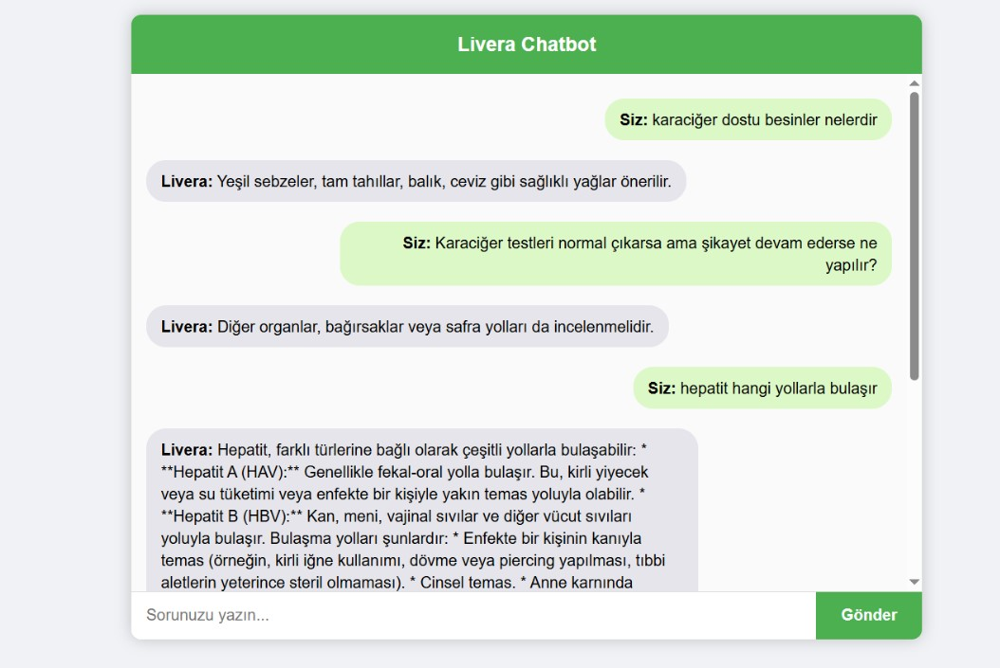

# Karaciğer Chatbot (Livera)

Livera, Flask tabanlı bir web chatbot uygulamasıdır.  
Kullanıcıların **karaciğer ile ilgili sorularını** cevaplamak için hem **CSV veri seti** hem de **Gemini API** kullanır.  
Eğer soru CSV’de bulunmazsa, yanıt Gemini API üzerinden alınır.

---

##  Özellikler
- Python & Flask tabanlı backend
- Kullanıcı dostu web arayüzü (sohbet balonları tasarımı)
- TF-IDF + Cosine Similarity ile CSV’den en yakın cevabı bulma
- Gemini API fallback (sorular CSV’de yoksa)
- `.env` ile güvenli API key yönetimi

---

##  Proje Yapısı

